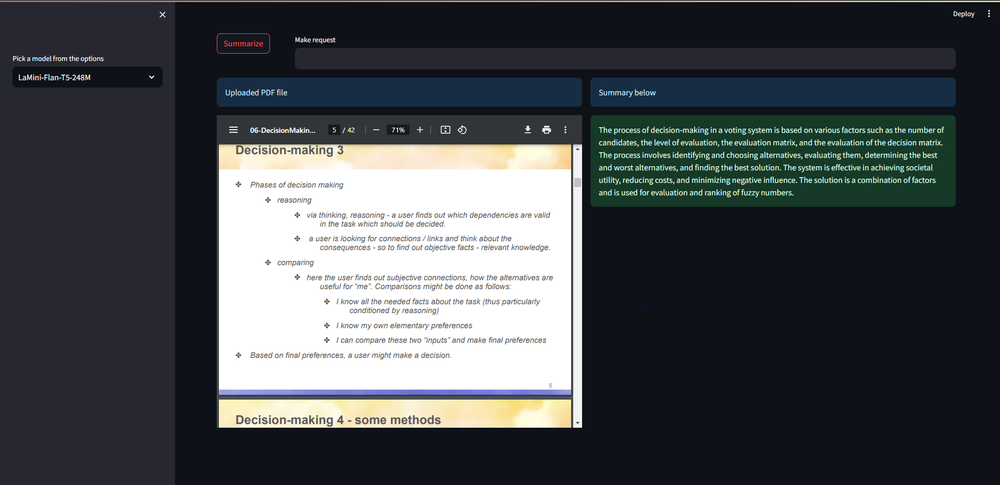

# Custom LLM Test

## Initialise your environment

## Install requirements

## To run app, run 'streamlit run app.py'

The app;lication takes a PDF file and allows the user to prompt for information on the file
or to summarise the information in the file.

## Current Drawbacks

* Appclication cannot summarise large documents
* Models are not really accurate

## Proposed solutions

* Use a RAGs to in the pipeline processs to solve large documents issue
* Find better models that can run locally if possible.

